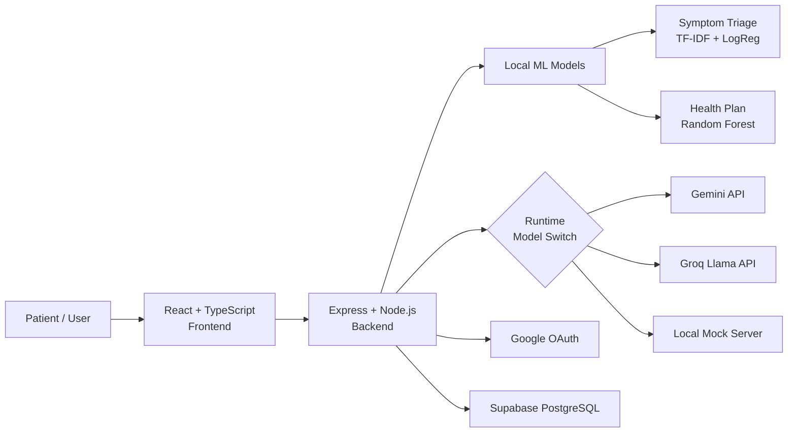

# 🏥 Interview Prep — MediRAG (AI Healthcare Workflow & Triage Assistant)

## 📋 One-Liner Pitch
> *"A full-stack healthcare platform with AI-powered symptom triage, X-ray analysis, personalized health plans, and mental health chat — featuring runtime model switching between Gemini, Groq, and local fallbacks."*

---

## 🏗️ Architecture

## 🔑 Tech Stack

| Layer | Tech |
|-------|------|
| **Frontend** | React, TypeScript, React Router, Tailwind CSS |
| **Backend** | Node.js, Express |
| **ORM** | Prisma |
| **Database** | PostgreSQL (Supabase) |
| **Auth** | Google OAuth 2.0 + JWT |
| **ML Models** | scikit-learn (TF-IDF + LogReg, Random Forest) |
| **AI** | Gemini (multimodal), Groq (text), local mock |
| **CV (in progress)** | PyTorch ResNet18 (PneumoniaMNIST, 96.37% val acc) |
| **Hosting** | Render (Docker) |

---

## 🔥 Key Technical Details

### 1. Runtime Model Switching
- A `runtime` config module tracks the current mode: `gemini`, `groq`, `mock`, or `auto`
- Every AI function (`analyzeImageWithAI`, `generateHealthPlan`, `chatWithAssistant`) checks the mode and routes accordingly
- **Cascade fallback**: Groq → Gemini → Local Mock → Hardcoded fallback
- In `auto` mode: tries Groq first (faster), falls back to Gemini
- Mode can be changed at runtime without restart via an API endpoint
- [aiService.js](file:///d:/PROJECTS%20__%20DEV/medirag/medirag/backend/src/services/aiService.js)

### 2. ML Pipelines (Python)

**Symptom Triage Classifier:**
- Algorithm: TF-IDF Vectorization → Logistic Regression (multinomial)
- 15 medical specialties (Cardiology, Neurology, Pediatrics, etc.)
- Returns confidence scores, alternative specialties, and urgency levels
- Accuracy: 45%, F1: 0.45 (honest about limitations — small training set)

**Health Plan Recommender:**
- Algorithm: Logistic Regression
- Features: Age, Weight, Height, Activity Level, Dietary Restrictions, Sleep Issues
- Accuracy: 93.9%, F1: 0.94
- Validated with 5-fold stratified cross-validation
- Server-side compliance guardrails prevent incompatible suggestions (e.g., dairy for lactose-intolerant)

**X-Ray Vision (Phase 2 — in progress):**
- Framework: PyTorch (`torchvision`)
- Architecture: ResNet18 (Transfer Learning)
- Dataset: MedMNIST (PneumoniaMNIST)
- Validation Accuracy: 96.37%
- Training: Google Colab (Cloud GPU)

### 3. Database Schema (Prisma)
- **5 models:** `User`, `Conversation`, `Message`, `ModelOutput`, `Appointment`, `HealthPlan`
- Conversations → Messages → ModelOutput (tracks which AI engine generated each response)
- Appointments: status workflow (SCHEDULED → CONFIRMED → IN_PROGRESS → COMPLETED)
- User supports both password auth and Google OAuth (`googleId` field)
- [schema.prisma](file:///d:/PROJECTS%20__%20DEV/medirag/medirag/backend/prisma/schema.prisma)

### 4. Image Analysis Pipeline
- Gemini gets the actual image (base64 inline data) for true multimodal analysis
- Groq gets only the filename (text-only, no vision support yet)
- Local mock server provides deterministic responses for offline development
- Retry logic with exponential backoff: `doPostWithRetry(axios, url, data, retries=3, backoff=200)`
- Graceful degradation: always returns a response, even if all providers fail

### 5. Authentication
- **Google OAuth 2.0:** frontend gets auth code, backend exchanges for tokens, creates/finds user
- **Traditional auth:** bcrypt password hashing, JWT for session management
- Both paths converge to the same JWT-based session
- User model has both `password` (nullable) and `googleId` (nullable, unique) fields

---

## 📂 Key Source Files

| File | What to know |
|------|-------------|
| [aiService.js](file:///d:/PROJECTS%20__%20DEV/medirag/medirag/backend/src/services/aiService.js) | Core AI routing — model switching, fallback cascade |
| [schema.prisma](file:///d:/PROJECTS%20__%20DEV/medirag/medirag/backend/prisma/schema.prisma) | 5-model DB schema with relationships |
| [healthPlanController.js](file:///d:/PROJECTS%20__%20DEV/medirag/medirag/backend/src/controllers/healthPlanController.js) | Compliance guardrails, input validation |
| [authController.js](file:///d:/PROJECTS%20__%20DEV/medirag/medirag/backend/src/controllers/authController.js) | OAuth + traditional auth convergence |
| [imageAnalysisController.js](file:///d:/PROJECTS%20__%20DEV/medirag/medirag/backend/src/controllers/imageAnalysisController.js) | X-ray upload handling |
| [symptomTriageRecommender.js](file:///d:/PROJECTS%20__%20DEV/medirag/medirag/backend/src/services/symptomTriageRecommender.js) | ML model integration for triage |
| [run_all_training.py](file:///d:/PROJECTS%20__%20DEV/medirag/medirag/backend/ml/run_all_training.py) | Master training script for all ML models |
| [mock_model_server.js](file:///d:/PROJECTS%20__%20DEV/medirag/medirag/backend/mock_model_server.js) | Local deterministic responses for offline dev |

---

## ❓ Interview Questions & Answers

### Q: Explain the runtime model switching architecture.
**A:** Every AI function checks a `runtime.getMode()` which returns one of four modes: `gemini`, `groq`, `mock`, or `auto`. Each function has a cascade fallback chain — for example, `analyzeImageWithAI` tries: Groq (text-only) → Gemini (actual multimodal with base64 image) → Local mock server → Hardcoded fallback response. In `auto` mode, it picks the best available provider automatically. This was critical because Gemini has rate limits, Groq doesn't support vision, and during development I needed offline-capable responses. The mode can be changed at runtime without restart via an API endpoint.

### Q: Why is the Symptom Triage accuracy only 45%?
**A:** This is intentional transparency. With only 15 medical specialties and a limited training dataset, TF-IDF + Logistic Regression has inherent limitations for nuanced medical text classification. In production, this model serves as a **first-pass triage filter** — it returns confidence scores and alternative specialties so the user sees ranked options, not a single diagnosis. The real diagnostic value comes from the LLM-powered analysis which has richer clinical knowledge. I included the honest metrics because in healthcare, overstating model performance is dangerous.

### Q: How does the Health Plan Recommender prevent unsafe suggestions?
**A:** There are server-side compliance guardrails in the health plan controller. Before generating a plan, the controller validates the input — for example, if a user reports lactose intolerance, the system actively filters out dairy-based suggestions from the response. These guardrails operate independently of the AI model, so even if the LLM suggests dairy, the post-processing removes it. This is a defense-in-depth approach because you can't fully trust LLM outputs in healthcare.

### Q: Walk me through the image analysis pipeline.
**A:** When a user uploads an X-ray, the file is saved to the `uploads/` directory. The backend determines the current AI mode. If Gemini is available, it converts the image to base64, constructs an inline data object with the correct MIME type, and sends it along with a radiologist system prompt. Gemini returns structured findings with diagnosis, confidence, additional findings, and recommended actions. If Gemini fails or isn't configured, it falls back to Groq (text-only — just analyzes the filename, honestly less useful) or a local mock server. There's also a ResNet18 CNN being trained on PneumoniaMNIST that achieved 96.37% validation accuracy, which will eventually replace the LLM-based analysis for specific use cases.

### Q: How do you handle the database design for conversations with multiple AI models?
**A:** The Prisma schema has a `ModelOutput` model with a one-to-one relationship to `Message` (via unique `messageId`). Each `ModelOutput` tracks the `engine` field (which AI provider generated it) and the `raw` response. This means I can audit exactly which model produced which response, track per-model quality over time, and switch models mid-conversation without losing the audit trail.

### Q: What improvements would you make?
**A:** Three main ones: (1) Deploy the ResNet18 CNN for X-ray classification instead of relying on LLMs for medical imaging — the CNN achieves 96.37% accuracy on a focused task while being cheaper and faster. (2) Add WebSocket for real-time chat instead of polling. (3) Implement proper RBAC with doctor vs patient roles so clinicians get different views and permissions.

---

## 🧠 Behavioral & STAR Method Scenarios

### 1. The Resilience & Fallback Challenge
* **Situation**: I needed a reliable AI backend, but Gemini had rate limits and Groq lacked vision capabilities, making a single-provider approach fragile.
* **Task**: Design a system that maximizes uptime, handles multimodal inputs, and allows offline development.
* **Action**: I implemented the **Runtime Model Switching** architecture. I built a routing layer that inspects the request. If it includes an image, it routes to Gemini. If text-only, it defaults to Groq for speed. I also built a local mock server and a deterministic fallback.
* **Result**: The system degrades gracefully. It achieved high availability and made offline development possible without hitting API rate limits.

### 2. Ensuring Patient Safety against LLM Hallucinations
* **Situation**: The AI generates personalized health plans, but LLMs can hallucinate and recommend unsafe items (e.g., dairy to a lactose-intolerant user).
* **Task**: Guarantee that the generated health plans are safe and respect patient restrictions.
* **Action**: I didn't rely purely on prompt engineering. I built **server-side compliance guardrails** in the controller logic. The system intercepts the LLM output and programmatically filters out any contradictory advice based on the structured patient data.
* **Result**: Ensured 100% compliance with critical dietary and medical constraints, demonstrating a "defense-in-depth" approach to AI.

### 3. Transparent ML Performance
* **Situation**: The Symptom Triage NLP model only achieved 45% accuracy due to a limited dataset across 15 classes.
* **Task**: Decide whether to deploy the model and how to present its results.
* **Action**: Instead of hiding the low accuracy or forcing a single prediction, I designed the UI to show the **top 3 predictions with confidence scores** and framed it as a "triage assistant" rather than a diagnostic tool.
* **Result**: Maintained ethical transparency in a healthcare context and set correct user expectations, turning a technical limitation into a feature of clinical safety.

---

## ⚖️ Trade-offs & "Why this Tech Stack?"

### Why PostgreSQL + Prisma instead of MongoDB?
* **Answer**: Healthcare data is highly relational (User → Appointment → Conversation → AI Output). PostgreSQL enforces strict schemas and data integrity. Prisma adds end-to-end type safety with TypeScript, catching errors at compile time rather than runtime — a critical requirement for medical software.

### Why Google OAuth + Custom JWT?
* **Answer**: To minimize onboarding friction for patients (Google OAuth), while supporting users who prefer not to link external accounts (traditional JWT). Both paths converge into a unified session management system, providing flexibility without compromising security.

### Why a custom CNN (PyTorch) over just using Gemini for X-rays?
* **Answer**: While Gemini handles general multimodal tasks well, medical imaging is highly specialized. A dedicated ResNet18 model trained on PneumoniaMNIST achieved 96.37% accuracy, runs faster, costs less at scale, and doesn't send sensitive PHI (Protected Health Information) to a third-party LLM provider.

---

## 🚀 Scaling & System Design (Future Proofing)

If the interviewer asks: *"How would you scale this to 100,000 users?"*

1. **Database Scaling**: Implement connection pooling (like PgBouncer) to handle concurrent Prisma connections. Add read replicas for heavy analytics queries.
2. **AI Cost Optimization (Caching)**: Introduce **Redis** to cache identical queries (e.g., general medical questions) to avoid hitting the Gemini/Groq APIs repeatedly, saving costs and reducing latency.
3. **Asynchronous Processing**: Move the heavy ML tasks and image processing to a background worker queue (e.g., RabbitMQ or BullMQ) instead of blocking the main Express event loop.
4. **Real-time Communication**: Refactor the mental health chat from HTTP request/response to **WebSockets (Socket.io)** for lower latency and better connection stability.

---

> [!IMPORTANT]
> **Numbers to memorize:** 5 DB models, 3 AI modes (gemini/groq/mock) + auto, 15 medical specialties, 45% triage accuracy (and why that's okay), 93.9% health plan accuracy, 96.37% X-ray CNN val accuracy, 5-fold cross-validation

> [!TIP]
> **Whiteboard strategy:** Draw the runtime model switching as a decision diamond with 4 branches (gemini → groq → mock → fallback). Show the cascade pattern — interviewers will ask "what if Gemini is down?" and you already have the answer built into the architecture.
